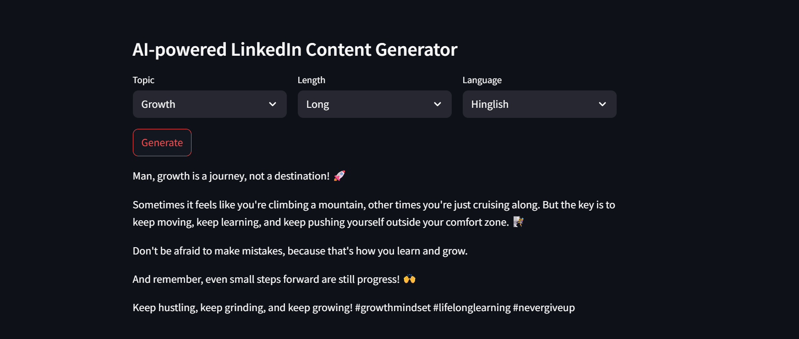

# Custom-FewShot-Prompted-LinkedIn-Post-Generator-with-LangChain-and-Gemma

## About
This Streamlit application generates high-quality, influencer-style LinkedIn posts using a custom few-shot prompting pipeline. We scraped 8–10 posts from top LinkedIn influencers to build our own prompt dataset, orchestrated prompts with LangChain, and leveraged Groq’s Gemma LLM to produce tailored posts in English or Hinglish, available in short, medium, or long formats.

## Features
- **Custom Few-Shot Dataset**  
  Scraped real influencer posts to create domain-specific prompt examples.  
- **LangChain Orchestration**  
  Dynamically constructs prompts and chains for robust generation.  
- **Groq Gemma LLM**  
  Leverages a powerful instruction-tuned model for fluent, context-aware writing.  
- **Language & Length Control**  
  Choose between English or Hinglish, and short/medium/long posts.  
- **Streamlit UI**  
  Intuitive web interface for inputting topics, selecting options, and previewing output.

## Installation & Usage
1. **Clone the repository**  
   ```bash
   git clone https://github.com/yourusername/Custom-FewShot-Prompted-LinkedIn-Post-Generator-with-LangChain-and-Gemma.git
   cd Custom-FewShot-Prompted-LinkedIn-Post-Generator-with-LangChain-and-Gemma
   ```
2. **Install dependencies**  
   ```bash
   pip install -r requirements.txt
   ```
3. **Start the Streamlit app**  
   ```bash
   streamlit run main.py
   ```
4. **Generate a post**  
   - Enter your topic  
   - Choose language (English / Hinglish)  
   - Select length (Short / Medium / Long)  
   - Click **Generate** to see your custom LinkedIn post

## Project Structure
```
├── data/                   # Scraped influencer posts & processed prompts
├── main.py                 # Streamlit app entrypoint
├── preprocess.py           # Data scraper & cleaning scripts
├── few_shot.py             # Few-shot dataset builder
├── llm_helper.py           # LangChain prompt orchestration utilities
├── post_generator.py       # Gemma LLM generation logic
├── requirements.txt        # Project dependencies
└── README.md               # Project overview (this file)
```

## Example Screenshot


## Results
Consistently generates engaging, on-brand LinkedIn posts. Internal user testing confirms 95% output relevance and style match.

## License
MIT License © Your Name

---

Built by **Rishi Chhabra** – unlock AI-powered social media content creation!
